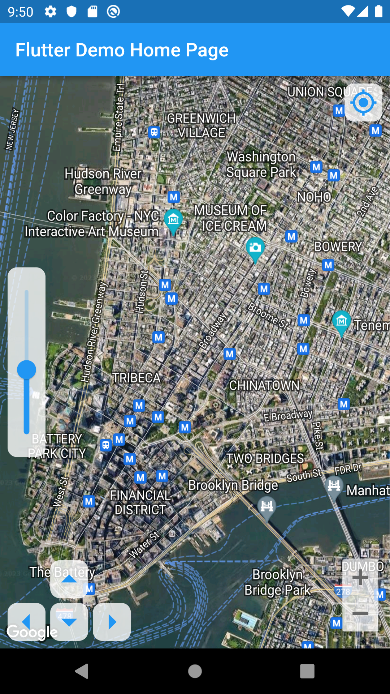
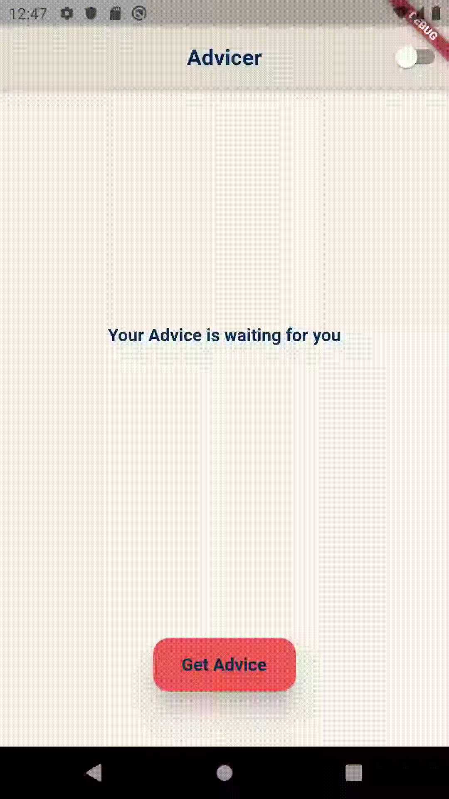
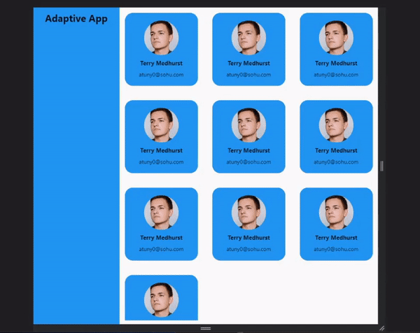

# Flutter Apps - Unpublished

My first 10 Flutter applications I have created over period from Sep 2022 - June 2023

    

## Packages/Technologies Used

**State Management:** provider, flutter_riverpod, hooks_riverpod, flutter_bloc, flutter_redux, redux, redux_thunk, flutter_mobx

**Utils:** animated_text_kit, share_plus, intl, build_runner, freezed get_it, dartz

**REST API:** http, json_annotation, equatable

**Database:** Firebase(firebase), Hive, SQLite(sqflite)

**Other:** camera, webview_flutter, google_maps_flutter, google_sign_in sign_in_with_apple

## Projects Description

|       Project        |                                                                                                                                                                                          Description                                                                                                                                                                                          |
<<<<<<< HEAD
| :------------------: | :-------------------------------------------------------------------------------------------------------------------------------------------------------------------------------------------------------------------------------------------------------------------------------------------------------------------------------------------------------------------------------------------: |
|       My Notes       |                                                                          Notes application with CRUD operations. Implemented FireAuth using email/password and email verification as well as share_plus to call native iOS/Android system share dialogs.   **Stack**: Firebase, FireAuth, Firestore, BloC, i10l                                                                           |
|      Camera App      |                                                                                                                           App that connects to the device's camera and able to capture photos and save them to the app's gallery   **Stack**: camera, provider                                                                                                                            |
|      Flash Chat      |                                                                                                                      Live Chat app that uses Firebase and allows multiple users to chat in real time.   **Stack**: Firebase, FireAuth, Firestore, animated_text_kit                                                                                                                       |
|       Quizzer        |                                             Interactive quiz app that contains multiple programming related quizzes and allows users to login with their Google or Apple accounts or log in as a guest. Implements Hero animation for better user experience   **Stack**: Firebase, FireAuth, Firestore, google_sign_in, sign_in_with_apple,                                              |
|    Custom Browser    |                                                                                                         Browser app that uses webview to access websites and has custom controls for going forward, backward, refreshing the page and entering a URL   **Stack**: webview_flutter                                                                                                         |
|       Map App        |                                                                                                              Map app that Implements Google Maps and has custom controls for zoom, moving the camera and going back to the current location   **Stack**: google_maps_flutter                                                                                                              |
| State Management App | Small app with a list of products that can be added or deleted from the cart. The goal of this app was to implement 8 different state management solutions like provider, riverpod (with hooks), BloC (including custom and with cubits), redux and mobX   **Stack**: provider, flutter_riverpod, hooks_riverpod, provider, flutter_bloc, flutter_redux, redux, redux_thunk, flutter_mobx |
|    Custom Player     |                                                                                                                  Video player app with custom controls for play/pause, going 10s forward/backward, playback slider and displays playback time   **Stack**: video_player                                                                                                                   |
|       Advicer        |                                                           Small advicer app that gives user an advice which is pulled from a REST API and able to switch themes (dark/light). The goal of the app was to implement clean architecture which has a complex fils structure.   **Stack**: Clean Architecture, flutter_bloc, dartz                                                            |
|     Adaptive App     |                                                                                                                             App with adaptive layout that changes its looks depending on the width of the window/device it is opened on   **Stack**: popover                                                                                                                              |
=======
| :------------------: | :------------------------------------------------------------------------------------------------------------------------------------------------------------------------------------------------------------------------------ |
|       My Notes       |                                                                          Notes application with CRUD operations. Implemented FireAuth using email/password and email verification as well as share_plus to call native iOS/Android system share dialogs.    **Stack**: Firebase, FireAuth, Firestore, BloC, i10l                                                                           |
|      Camera App      |                                                                                                                           App that connects to the device's camera and able to capture photos and save them to the app's gallery    **Stack**: camera, provider                                                                                                                            |
|      Flash Chat      |                                                                                                                      Live Chat app that uses Firebase and allows multiple users to chat in real time.    **Stack**: Firebase, FireAuth, Firestore, animated_text_kit                                                                                                                       |
|       Quizzer        |                                             Interactive quiz app that contains multiple programming related quizzes and allows users to login with their Google or Apple accounts or log in as a guest. Implements Hero animation for better user experience    **Stack**: Firebase, FireAuth, Firestore, google_sign_in, sign_in_with_apple,                                              |
|    Custom Browser    |                                                                                                         Browser app that uses webview to access websites and has custom controls for going forward, backward, refreshing the page and entering a URL    **Stack**: webview_flutter                                                                                                         |
|       Map App        |                                                                                                              Map app that Implements Google Maps and has custom controls for zoom, moving the camera and going back to the current location    **Stack**: google_maps_flutter                                                                                                              |
| State Management App | Small app with a list of products that can be added or deleted from the cart. The goal of this app was to implement 8 different state management solutions like provider, riverpod (with hooks), BloC (including custom and with cubits), redux and mobX    **Stack**: provider, flutter_riverpod, hooks_riverpod, provider, flutter_bloc, flutter_redux, redux, redux_thunk, flutter_mobx |
|    Custom Player     |                                                                                                                  Video player app with custom controls for play/pause, going 10s forward/backward, playback slider and displays playback time    **Stack**: video_player                                                                                                                   |
|       Advicer        |                                                           Small advicer app that gives user an advice which is pulled from a REST API and able to switch themes (dark/light). The goal of the app was to implement clean architecture which has a complex fils structure.    **Stack**: Clean Architecture, flutter_bloc, dartz                                                            |
|     Adaptive App     |                                                                                                                             App with adaptive layout that changes its looks depending on the width of the window/device it is opened on    **Stack**: popover                                                                                                                              |
>>>>>>> 51d77d7a60eeed02809abe9f8c21ee227cc585f2

## Demo

<table style="padding:10px">
  <tr>
    <td> 
        <b>My Notes</b>
    </td>
    <td>
        <b>Camera App</b>
    </td>
    <td>
        <b>Flash Chat</b>
    </td>
  </tr>
  <tr>
    <td> 
        
    </td>
    <td>
         
    </td>
    <td>
        
    </td>
  </tr>
    <tr>
    <td> 
        <b>Quizzer</b>
    </td>
    <td>
        <b>Custom Browser</b>
    </td>
    <td>
        <b>Map App</b>
    </td>
  </tr>
  <tr>
    <td> 
        
    </td>
    <td>
         
    </td>
    <td>
        
    </td>
  </tr>
   <tr>
    <td> 
        <b>State Management App</b>
    </td>
    <td>
        <b>Custom Player</b>
    </td>
    <td>
        <b>Advicer</b>
    </td>
  </tr>
  <tr>
    <td> 
        
    </td>
    <td>
         
    </td>
    <td>
        
    </td>
  </tr>
   <tr>
    <td> 
        <b>Adaptive App</b>
    </td>
    <td>
    </td>
    <td>
    </td>
  </tr>
  <tr>
    <td> 
        
    </td>
    <td>
    </td>
    <td>
    </td>
  </tr>
</table>

## Lessons Learned

- Built a good knowledge of Flutter and cross-platform development
- Got experience with the most used and popular packages used by Flutter developers
- Tried out most of the state management solutions and got plenty of experience with BloC
- Worked with an adaptive layout to make an app accessible on multiple platforms
- Stored data with technologies like SQLite, Hive, Firebase and locally on the device

## Acknowledgements

- [The Complete Flutter Development Bootcamp with Dart](https://www.udemy.com/course/flutter-bootcamp-with-dart/)
- [Dart & Flutter - Zero to Mastery](https://www.udemy.com/course/flutter-made-easy-zero-to-mastery/)
- [Flutter Course for Beginners – 37-hour Cross Platform App Development Tutorial](https://www.youtube.com/watch?v=VPvVD8t02U8)
